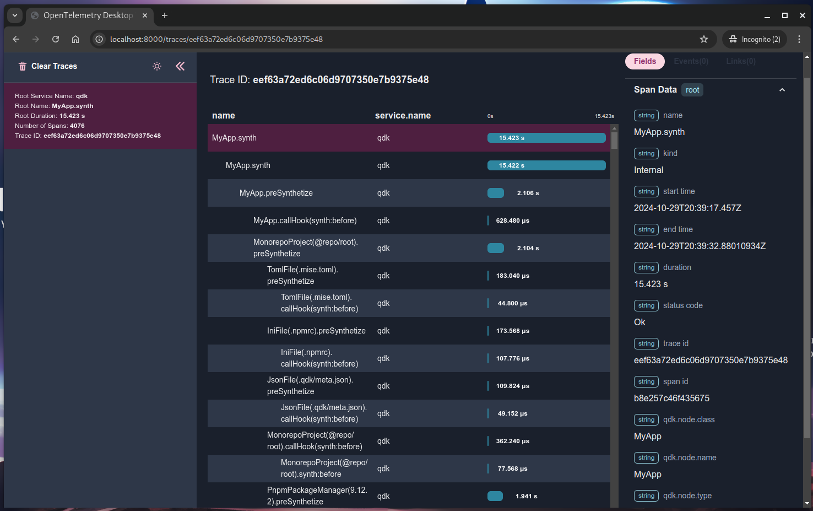
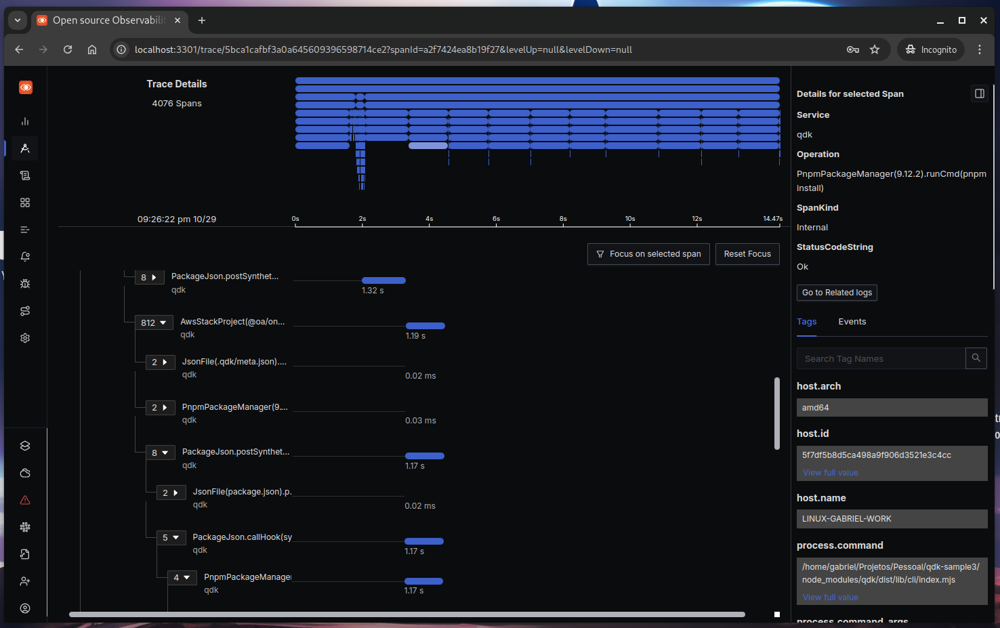

## QDK Instrumentation with OTLP Tracing

QDK supports OpenTelemetry (OTLP) tracing for enhanced visibility into operations during the QDK synthesis process. This enables performance profiling and easier debugging by capturing key details of QDK’s execution.

### Setting up a Tracing Viewer

To visualize tracing, choose a suitable viewer:

1. **Faster Viewer**: [Otel Desktop Viewer](https://github.com/CtrlSpice/otel-desktop-viewer) - Simple setup with fast results. Installation instructions are provided in the repository’s README.
   

2. **Feature-rich Viewer**: [Signoz](https://github.com/SigNoz/signoz) - Feature-rich and ideal for in-depth analysis but requires Docker.
   

   <details>
   <summary>Instructions for Installing Signoz</summary>

   To set up Signoz:

   1. Ensure `docker` and `docker-compose` are installed and updated.
   2. Clone the Signoz repository and install:

      ```sh
      git clone https://github.com/SigNoz/signoz
      cd signoz/deploy
      ./install.sh
      ```

   3. Once completed, access Signoz at `http://localhost:3301/traces-explorer`.

   </details>

### Running QDK with Tracing Enabled

Once a server is set up, you can run QDK with tracing using:

```
npx qdk synth --trace
```

To specify a custom OTLP endpoint, add:

```
npx qdk synth --trace --otlp-endpoint http://localhost:4318
```

### Configuration Options

You can customize tracing endpoints by setting the following environment variables:

- **OTEL_EXPORTER_OTLP_ENDPOINT**: This specifies the root endpoint for OTLP, which can handle both traces and metrics.

  - **Example**:

    ```sh
    export OTEL_EXPORTER_OTLP_ENDPOINT="http://localhost:4317"
    npx qdk synth --trace
    ```

- **OTEL_EXPORTER_OTLP_TRACES_ENDPOINT**: This is an additional endpoint specifically for traces, providing flexibility in how trace data is sent.

  - **Example**:

    ```sh
    export OTEL_EXPORTER_OTLP_TRACES_ENDPOINT="http://localhost:4318/v1/traces"
    npx qdk synth --trace
    ```

- **`--otlp-endpoint`**: You can pass a URL directly to override the default endpoint.

  - **Example**:

    ```sh
    npx qdk synth --trace --otlp-endpoint http://localhost:4318
    ```

If no specific endpoint is provided, the SDK will default to using `http://localhost:4318/v1/traces`.

For detailed configuration options, you can refer to the [OpenTelemetry documentation](https://opentelemetry.io/docs/languages/sdk-configuration/otlp-exporter/).
